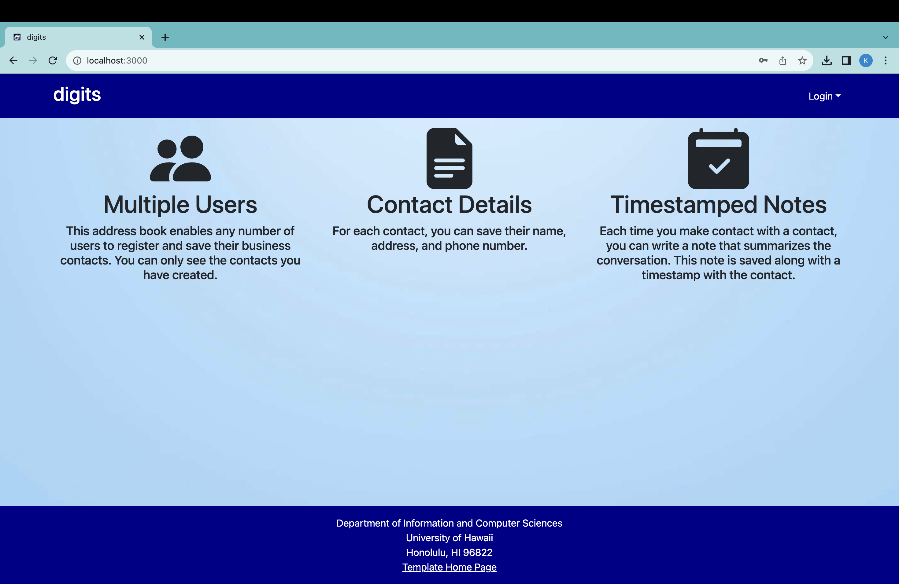
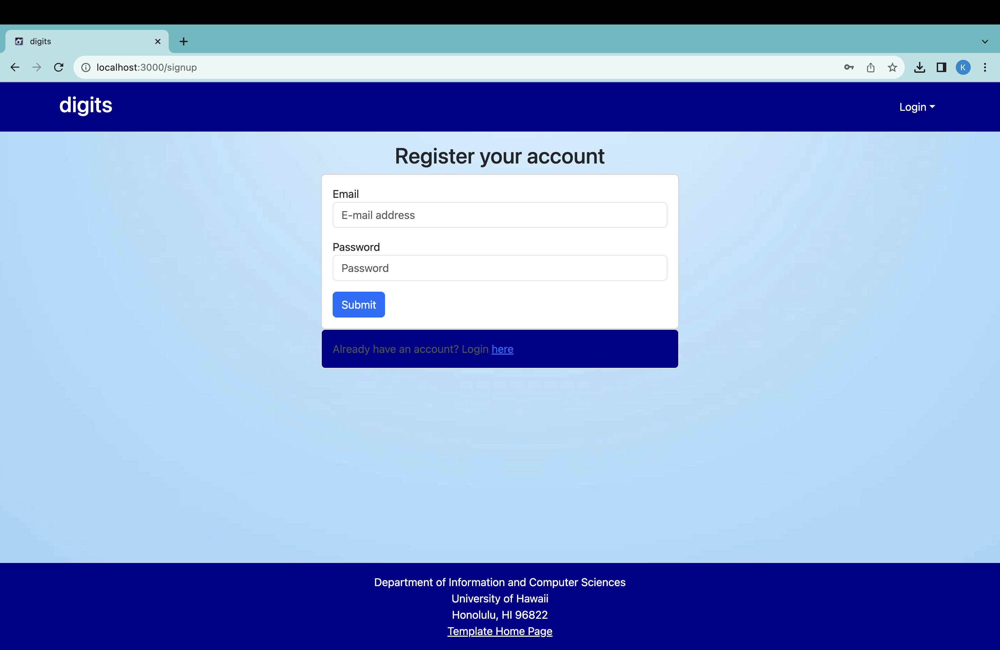
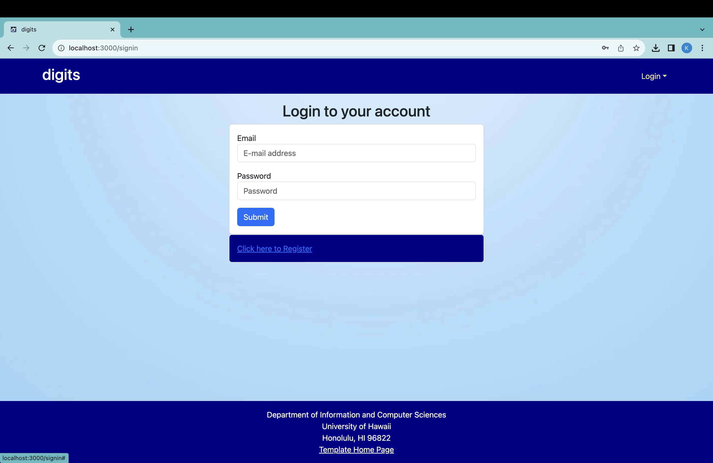
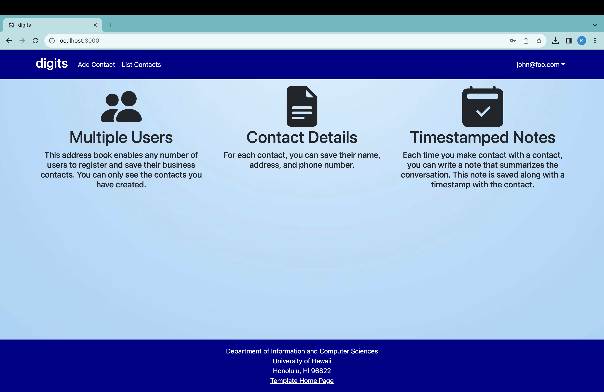
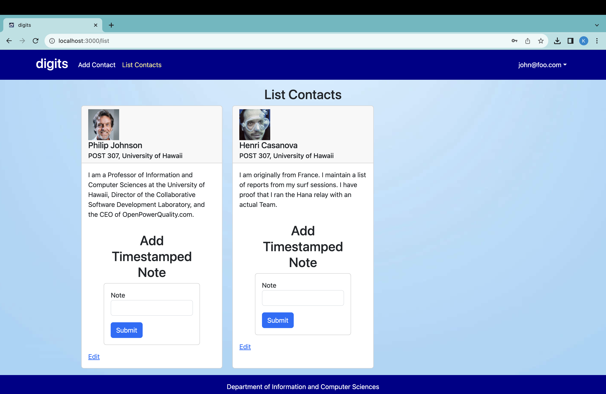
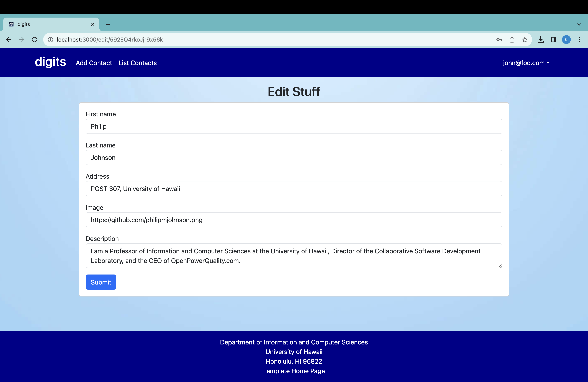
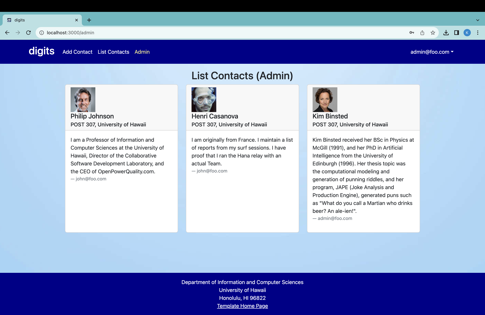

Digits is a Meteor application that allows user to: 

* Register an account
* Create and edit a list of contacts
* Create timestamped notes pertaining to people on their contacts list

## Installation

First, [install Meteor](https://www.meteor.com/install).

Second, go to [https://github.com/kristineorpilla03/digits](https://github.com/kristineorpilla03/digits), and download a copy of Digits. The repo is private, so you must request permission from the author.

Then, cd into the app/ directory of your local copy of the repo, and install third party libraries with:

```
$ meteor npm install
```

Once the libraries are installed, you can run the application by invoking:

```
$ meteor npm run start
```

The first time you run the app, it will create some default users and data. Here is the output:

```
meteor npm run start

> meteor-application-template-react@ start /Users/kristineorpilla/Desktop/GitHub/digits/app
> meteor --no-release-check --exclude-archs web.browser.legacy,web.cordova --settings ../config/settings.development.json

[[[[[ ~/Desktop/GitHub/digits/app ]]]]]       

=> Started proxy.                             
=> Started HMR server.                        
=> Started MongoDB.                           
I20231107-18:53:16.384(-10)? Creating the default user(s)
I20231107-18:53:16.390(-10)?   Creating user admin@foo.com.
I20231107-18:53:16.891(-10)?   Creating user john@foo.com.
I20231107-18:53:17.000(-10)? Creating default data.
I20231107-18:53:17.000(-10)?   Adding: Johnson (john@foo.com)
I20231107-18:53:17.012(-10)?   Adding: Casanova (john@foo.com)
I20231107-18:53:17.013(-10)?   Adding: Binsted (admin@foo.com)
=> Started your app.

=> App running at: http://localhost:3000/
```

If all goes well, the Digits application will appear at [http://localhost:3000](http://localhost:3000).  You can login using the credentials in [settings.development.json](https://github.com/ics-software-engineering/meteor-application-template-react/blob/main/config/settings.development.json), or else register a new account.

### ESLint

You can verify that the code obeys our coding standards by running ESLint over the code in the imports/ directory with:

```
meteor npm run lint
```

## User Interface Walkthrough

### Landing Page
When first opening the application, the landing page will appear with a brief introduction of what Digits can do:


### Register
If you do not have an account, you can register by clicking “Login”, then “Sign Up”:


### Sign In
Clicking on the Login link, click on the Sign in link to bring up the Sign In page which allows you to login:


### User Home Page
After successfully logging in, you will be shown the home page. It is just like the landing page, but the NavBar contains links to the list contact and the add new contacts pages:


### List Contacts Page
Clicking on the List Contacts link, you will be brought to a page that lists all of the contacts associated with the logged in user. This page also allows users to add timestamped notes beneath a contact:


### Edit Contacts Page
From the List Contacts page, the user can edit any Contact by clicking on the "Edit" link. This will bring up a page that shows the Contact information that can be edited:


### Admin Page
When a user is assigned a "Admin" role, they are able to access a NavBar that includes an additional link called "Admin." The "Admin" page lists all the Contacts of all the users, identifying who has the Contact:
